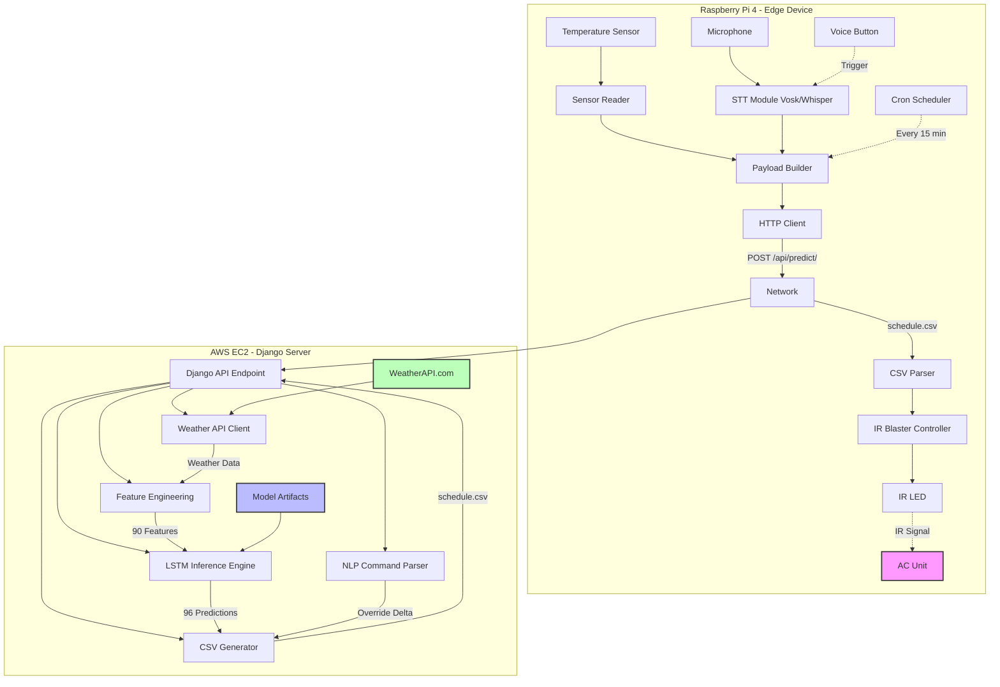
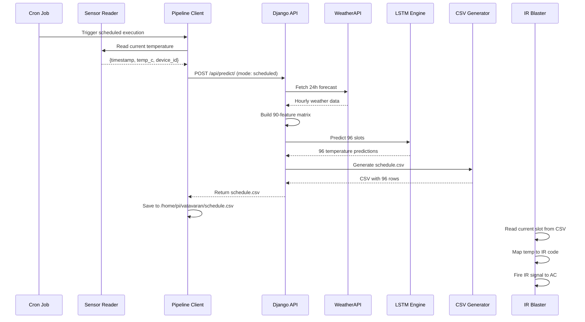

# Design Document: Vatavaran Climate Control System

## Overview

Vatavaran is a distributed smart climate control system that predicts and automates AC temperature settings using LSTM-based machine learning. The system operates across two computing environments: a Raspberry Pi 4 for edge sensing and control, and an AWS EC2 instance for ML inference and weather integration. The RPi collects sensor data and voice commands, sends them to EC2 for processing, receives a 24-hour temperature schedule (96 15-minute slots), and executes IR commands to control the AC unit. The system supports two trigger modes: scheduled execution every 15 minutes, and voice command overrides for immediate adjustments.

## Architecture



## Main Workflow Sequence Diagrams

### Scheduled Mode (Every 15 Minutes)



### Voice Override Mode

```mermaid
sequenceDiagram
    participant User as User
    participant Button as Voice Button
    participant STT as STT Module
    participant Client as Pipeline Client
    participant EC2 as Django API
    participant NLP as NLP Parser
    participant CSV as CSV Generator
    participant IR as IR Blaster
    
    User->>Button: Press button / say wake word
    Button->>STT: Trigger recording (5 sec)
    User->>STT: "It's too hot"
    STT->>STT: Vosk/Whisper transcription
    STT-->>Client: "it's too hot"
    Client->>Client: Read sensor data
    Client->>EC2: POST /api/predict/ (mode: voice_override, command_text)
    EC2->>EC2: Fetch weather & build features
    EC2->>EC2: Run LSTM predictions
    EC2->>NLP: Parse command with current temp
    NLP-->>EC2: {delta: -2} or {absolute: 22}
    EC2->>CSV: Apply override to next 4 slots
    CSV-->>EC2: Updated schedule.csv
    EC2-->>Client: Return schedule.csv
    Client->>Client: Save schedule.csv
    IR->>IR: Detect schedule change
    IR->>IR: Apply new temperature immediately
    IR->>IR: Fire IR signal to AC
